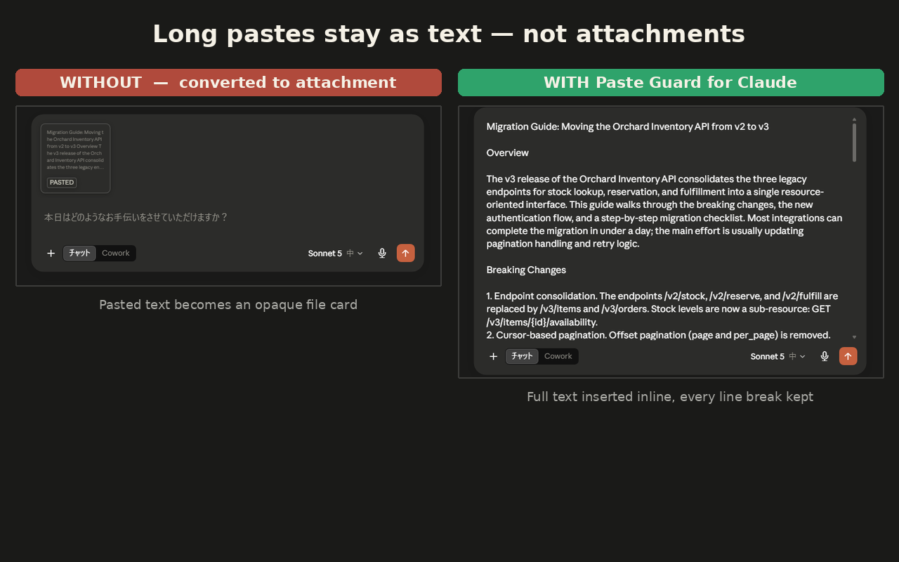

# Paste Guard for Claude

Keeps long pastes as **editable inline text** in [claude.ai](https://claude.ai) instead of letting them be auto-converted into file attachments.

claude.ai に長文を貼り付けると自動的に添付ファイルへ変換され、テキストのまま保持する選択肢がありません。本拡張は変換が起きる前にペーストを横取りし、改行・段落を保ったまま全文をメッセージ入力欄に直接挿入します。

## Features / 特徴

- Long text pastes (≥1,000 chars or ≥5 lines) stay as editable inline text — no more attachment cards
- Short pastes, image pastes, and file drops are untouched (normal site behavior)
- ~100,000 characters inserted near-instantly with zero character loss (measured, not assumed — see below)
- **Zero permissions**: no `clipboardRead`, no `storage`, no host permissions beyond the content-script match itself
- **Zero network**: the source contains no fetch/XHR — nothing is collected or sent anywhere ([Privacy Policy](./PRIVACY.md))
- **Fail-safe**: if claude.ai changes its UI and the editor can't be detected, the extension silently steps aside and the site's default behavior resumes

## Install / インストール

**Chrome Web Store**: https://chromewebstore.google.com/detail/paste-guard-for-claude/pfdppngcicgihbapegahkcoajmdepiad

**From source / ソースから (load unpacked):**

1. Generate icons: `pip install cairosvg --break-system-packages && python3 tools/make-icons.py`
2. Open `chrome://extensions`, enable **Developer mode**
3. **Load unpacked** → select this repository folder
4. Reload any open claude.ai tab

## How it works / 仕組み

A single content script (`main.js`, ~90 lines) runs at `document_start` in the page's `MAIN` world and registers a **capture-phase `paste` listener on `window`** — ahead of the site's own handlers. When a paste targets the message editor (`div.tiptap.ProseMirror`) and exceeds the threshold, it:

1. reads `event.clipboardData` (no clipboard permission needed — this is the user's own paste event),
2. calls `preventDefault()` + `stopImmediatePropagation()` before the site's attachment-conversion handler runs,
3. builds one paragraph node per line and inserts them via the page's own TipTap instance (`editor.commands.insertContent`), falling back to a raw ProseMirror transaction inside contexts that reject paragraphs (e.g. code blocks).

### Why `insertContent` and not `execCommand`?

Measured on the real claude.ai editor (mixed EN/JA text):

| Method | 10k chars | 100k chars | Fidelity |
|---|---|---|---|
| `document.execCommand('insertText')` | 343 ms | 17,681 ms | **lost 3,928 chars** at 100k |
| Raw PM transaction (`tr.insertText`) | 38 ms | 46 ms | newlines kept as literal `\n` in one text node |
| TipTap `insertContent` + paragraph nodes | 40 ms | **106 ms** | structurally correct paragraphs, zero loss |

`execCommand` degrades quadratically and silently drops characters at scale. The paragraph-node approach is both fast and structurally honest, so that's what ships.

## Known limitations / 既知の制限

- Pasting long text while the cursor is inside a code block falls back to raw text insertion (characters are preserved; formatting may differ)
- Rich-text (HTML) pastes are flattened to plain text above the threshold
- The editor detection depends on claude.ai's current DOM (`div.tiptap.ProseMirror` + TipTap's `element.editor`). If the site changes, the extension degrades to native behavior until updated

## Disclaimer / 免責

This is an unofficial, independent tool. It is not affiliated with, endorsed by, or sponsored by Anthropic. "Claude" is a trademark of Anthropic, PBC, used here only to indicate compatibility.

本拡張は非公式の独立したツールであり、Anthropic による提携・承認・後援を受けたものではありません。
